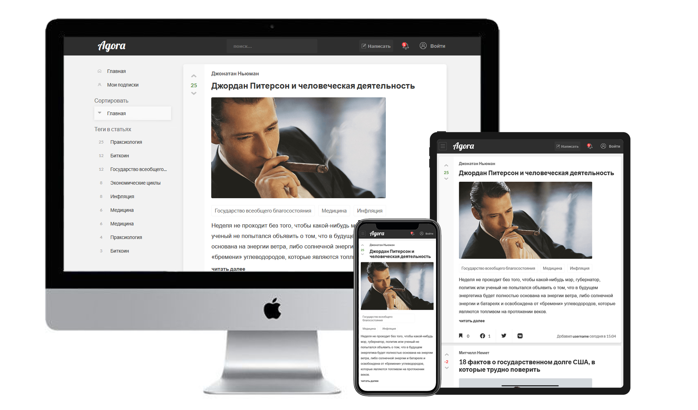
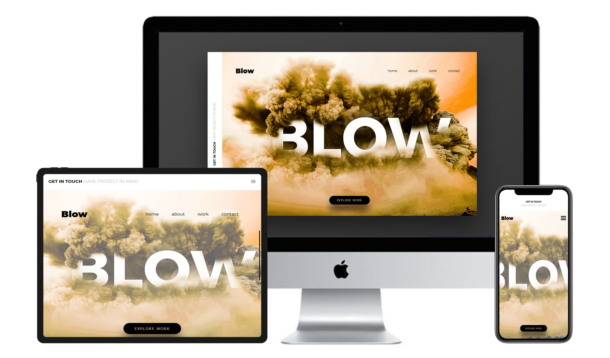

agora-flexbox |

*The design made by my dear friend Artur Berg. 

---------------------

blow-flexbox |

The quite simple, well-organized adaptive project on Flexbox basis. There I used BEM , SCSS , slightly JS :) 

*The design I took from the internet. 

---------------------

kong-css-grid |

This HTML markup is absolutely huge :D I used CSS GRID , BEM , SCSS , well-adaprive backgrounds that depend on width or device pixel ratio, that's nice

I think that I managed to implement my CSS GRID knowledge greatly, i'm glad that in 2019 this technology has the support 90% or even more

*The design I took from the internet.

