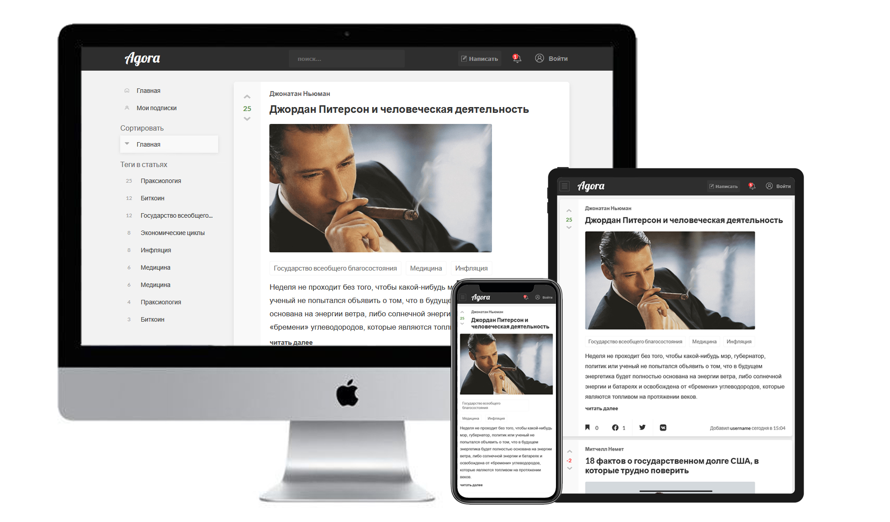
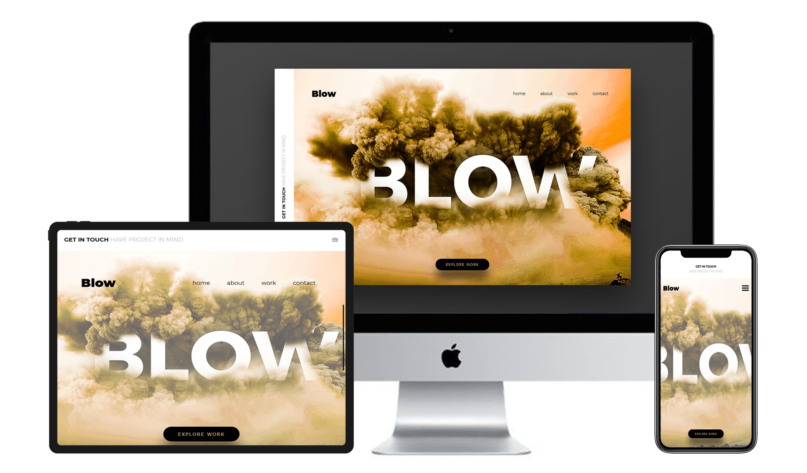
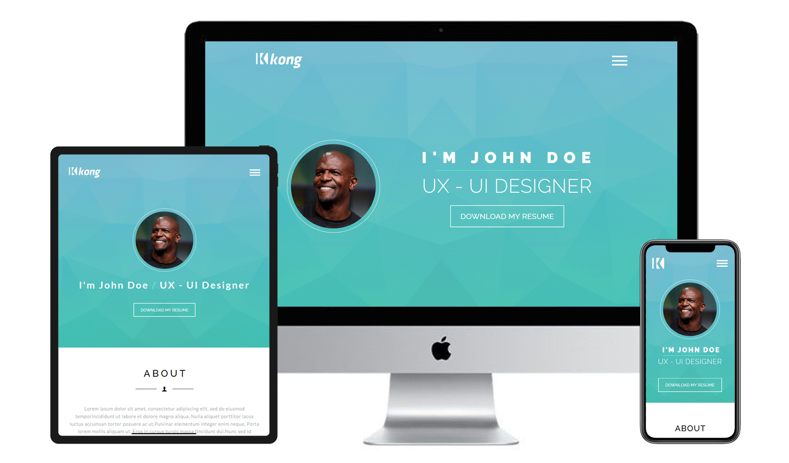

afrianska-flexbox | https://devshum.github.io/afrianska-flexbox/

Really a pure project which fully created with Flexbox, there is smooth animations on scroll, a couple of soft pop-ups, a nice hamburger menu with clean CSS, a cool adaptive design which as always I had to figured out on my own(I'm used to making it) because free templates on figma include a mobile design quite seldom 🙄

Also I succeed in practicing some PHP, the code was included in html and the folders but on GitHub Pages it isn't possible to show 😐

The desktop part of site as usual has the ~100% support on Google Page speed but due to built-in Google Map above the footer the mobile support and the console warnings were crushed 😫😫😫😫 There's no getting around it. 

I hope You'll like it as I like 

*The design I took from the Internet.

---------------------

miramax-floats | https://devshum.github.io/miramax-floats/

Another(and last in this portfolio, but who knows 🤣) markup is with floats but this time with Graham Miller's fluid grid(http://www.responsivegridsystem.com/), a really outstanding thing 😍

The valid HTML markup has a basic SEO optimization a lot of jQuery animations(waypoints plugin), a few my own keyframes CSS animations and a big CSS animation framework(https://daneden.github.io/animate.css/) which also included in this Sass 7-1 Pattern and looks smooth and well 🙂

To this one looks correct in Internet Explorer 6-8, Safari 4.x, Firefox 3.x. и iPhone 3.x. I included respond.js | html5shiv.min.js | selectivizr.min.js

*The design was created just in browser without a template,
this is a mix of my idea and a real miramax web-site page(https://www.miramax.com/movie/pulp-fiction/),
in this case ionicons(https://ionicons.com/) really helped me a lot 🎅

---------------------

fashion-blog-floats | https://devshum.github.io/fashion-blog-floats/

I've never ever used PUG preprocessor because I've wanted to learn SCSS preprocessor well. PUG is a technology, that stand one step above any CSS preprocessor and well I've really liked that thing, it allows to save time and HTML code looks much clean! I think that in furter I'll use PUG 🤠

And this is my first project in the portfolio with jQuery, I implemented an onScroll method that allows produce the header if the scroll height bigger than the intro height section.

I used the same things that I used below, namely: a Cross-Browser, a Responsive-Adaptive markup, SCSS, Svg-Sprites, BEM, Gulp, Desktop-First, The W3C Markup Validation and so on and certainly FLOATS, after Flexbox and CSS grid it was difficult 😥

*The design I took from the Internet. 

---------------------

agora-flexbox | https://devshum.github.io/agora-flexbox/

I really enjoyed to make this HTML markup(cross-browser, responsive-adaptive) because I absolutely like this kind of static websites like a blog or something similar 😄

In this one I used the same things as below that base on Flexbox and so on...
The markup also has a good support in 'The W3C Markup Validation Service', 'PageSpeed Insights' and has well-compressed images.

In the next markup I mean to make an old-standart site on Floats(some grid system) and PUG, because as I consider that kind of markup must be in a portfolio in spite of modern technologies like CSS Grid or Flexbox etc.

*The design made by my dear friend Arthur Berg. 

---------------------

blow-flexbox | https://devshum.github.io/blow-flexbox/

A quite simple(cross-browser, responsive-adaptive), well-organized adaptive project on Flexbox basis. There I used BEM , SCSS , slightly JS 😃

*The design I took from the Internet. 

---------------------

kong-css-grid | https://devshum.github.io/kong-css-grid/

This HTML(cross-browser, responsive-adaptive) markup is absolutely huge  I used CSS GRID , BEM , SCSS , well-adaprive backgrounds which depend on width or device pixel ratio, that's nice

I think that I managed to implement my CSS GRID knowledge greatly, I'm glad that in 2019 this technology has the support 90% or even more.

*The design I took from the Internet.

