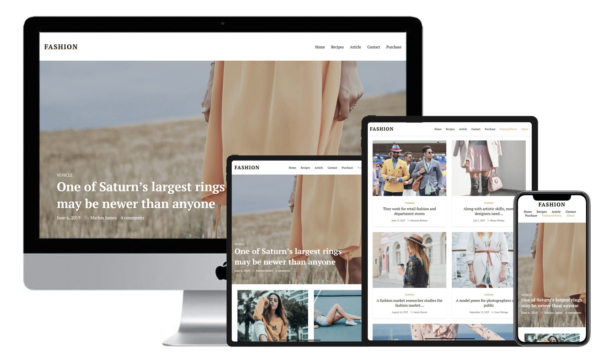

fashion-blog-floats | https://devshum.github.io/fashion-blog-floats/

I've never ever used PUG preprocessor because I've wanted to learn SCSS preprocessor well. PUG is a technology, that stand one step above any CSS preprocessor and well I've really liked that thing, its allows save time and HTML code looks more clean! I think that in furter I'll use PUG.

And this is my first project with jQuery, I implemented onScroll method that allows produce the header if scroll height bigger than intro height section.

I used the same things that I used below, namely: SCSS, BEM, responsive-adaptive markup, The W3C Markup Validation and certainly FLOATS, after Flexbox and CSS grid 
it was difficult =|

*The design I took from the Internet. 

---------------------

agora-flexbox | https://devshum.github.io/agora-flexbox/

I really enjoyed to make this HTML markup because I absolutely like this kind of static websites like a blog or something similar.

In the work I used the same things as below that base on Flexbox and so on...
This markup also has a good support in 'The W3C Markup Validation Service', 'PageSpeed Insights' and has well-compressed images.

In the next markup I mean to make an old-standart site on Floats(some grid system) and PUG, because as I consider that kind of markup must be in a portfolio in spite of modern technologies like CSS Grid or Flexbox etc.

*The design made by my dear friend Arthur Berg. 

---------------------

blow-flexbox | https://devshum.github.io/blow-flexbox/

The quite simple, well-organized adaptive project on Flexbox basis. There I used BEM , SCSS , slightly JS :) 

*The design I took from the Internet. 

---------------------

kong-css-grid | https://devshum.github.io/kong-css-grid/

This HTML markup is absolutely huge :D I used CSS GRID , BEM , SCSS , well-adaprive backgrounds that depend on width or device pixel ratio, that's nice.

I think that I managed to implement my CSS GRID knowledge greatly, i'm glad that in 2019 this technology has the support 90% or even more.

*The design I took from the Internet.

