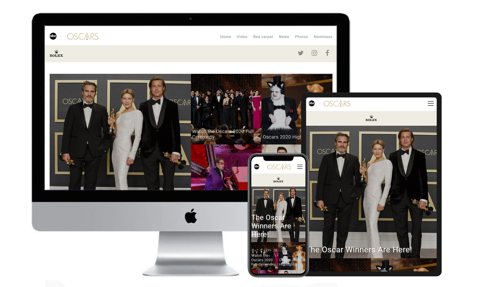
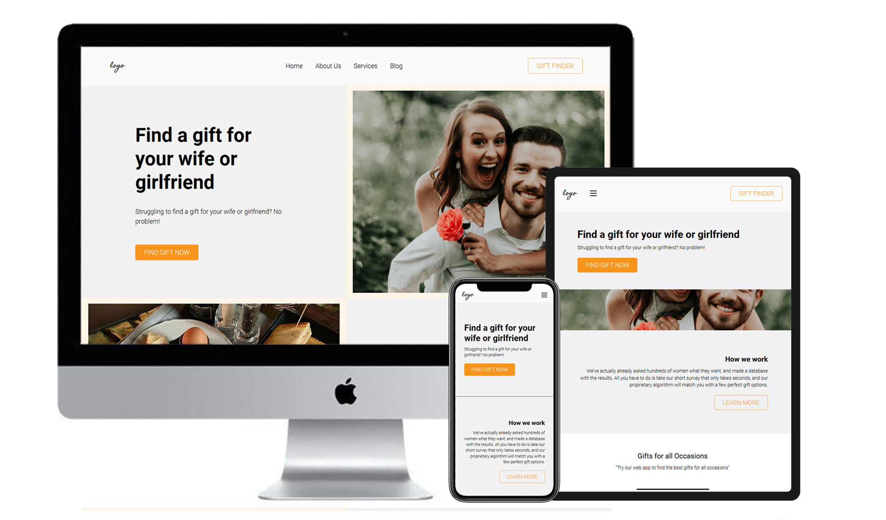

english-js-app-flexbox-mvc-es6-modules | https://devshum.github.io/

* 

band-of-brothers-bootstrap-4  | https://devshum.github.io/band-of-brothers-bootstrap-4

* 

---------------------

quiz-js-app-flexbox-mvc-es6-modules | https://devshum.github.io/quiz-js-app-flexbox-mvc-es6-modules

*The desing is from Udemy 

---------------------

oscar-flexbox-mobile-first | https://devshum.github.io/oscar-flexbox-mobile-first

Here's a mobile-first markup, I see only the advantages and the pros of this convenient approach. There is no need to expain that without doubt we have to use a robust mobile-first approach more and more. I experience true happines when I use this one.

This markup contains a cool header effect, a consistent scss structure, smooth animations(as usual), a menu etc, check it =)

*The desing is from a real oscars web-site(remade)

---------------------

vocabulary-js-app-flexbox-mvc | https://devshum.github.io/vocabulary-js-app-flexbox-mvc/

In this work I practiced an object oriented programming approach thanks to IIFE.

Also this project has a switch button, which changes the color theme thanks to a :root variable approach.

*The desing is mine

---------------------

multiplex-newsletter-table | https://devshum.github.io/multiplex-newsletter-table/

Check the E-Mail newsletter on GMAIL | UKR.NET | MAIL.RU

Check the E-Mail newsletter in GMAIL APP

This kind of markup involves huge efforts and concentration but the result lived up to my expectations, because the newsletter looks good everywhere :)

*The desing I took from my gmail SPAM :D

---------------------

schott-newsletter-table | https://devshum.github.io/schott-newsletter-table/

Check the E-Mail newsletter on GMAIL | UKR.NET | MAIL.RU

This is another interesting thing in WEB which I couldn't miss because IF you want to your newsletter displays correctly you need to use the TABLE approach instead of DIV, also the safe fonts, inline CSS properties, universal HTML tags, max-width, mandatory HTML attributes for the table, the inline elements, the images and also you'll need to write the color property without a reducion, for example: #ffffff instead of #fff 🙂👌✔

All those things are remnants of 90's and gives a huge obsolete result on The W3C Markup Validation Service.

*The common design I took from the Internet. I filled in the design with the content by myself.

---------------------

english-css-grid-mobile-first | https://devshum.github.io/english-css-grid-mobile-first/

This time I trained a mobile first markup with css-grid

The markup has good and adaptive photo galleries/navigations. The large gallery was created with css grid. I made that section very esily thanks to this one.

*The design I took from the Internet.

---------------------

prechu-flexbox-mobile-first | https://devshum.github.io/prechu-flexbox-mobile-first/

A cool and quite small but really modern markup(the design isn't modern itself) which I was making thanks to well-known and absolutely important in these days mobile-first approach 💫

I also included in this project the slick.js slider for the header, it's a powerful thing, too 💨

Otherwise I used the same thing as below: PUG, SCSS, JS and so on and so forth ♻

*The design I took from the Internet.

---------------------

roulette-js-game-css-grid ES6 modules | https://devshum.github.io/roulette-js-game-css-grid/

In front of you a DOM game(also adaptive and looks well on a phone), I'm glad that I successeded in creating this one using all the technics that I've already learnt and showed to you. As usual the project includes PUG(HTML preprocessor(with BEM)), SCSS(CSS preprocessor(CSS GRID)), a couple of animation, especially I liked a cylinder animation when you push the fire button.

The project was built with JS ES6 syntax and ES6 modules. The project has a base module and view module which connected with main index.js and do the job via function calls.
*The design created on my own.

---------------------

freebie-css-grid | https://devshum.github.io/freebie-css-grid/

I was creating this markup with great pleasure because I intended to revise my CSS Grid skills and the design looks outstanding and minimalistic.

I slightly experimented with rotation animations which also consist the background-blend-mode(created seperately form the original design by myself) and a property(hover: none) in parallel to media screen. Which is why I wanted to create this markup 😃 

*The design I took from the Internet.

---------------------

afrianska-flexbox | https://devshum.github.io/afrianska-flexbox/

Really a pure project which fully created with Flexbox, there are smooth animations on scroll, a couple of soft pop-ups, a nice hamburger menu with clean CSS, a cool adaptive design which as always I figured out on my own(I'm used to making it) because free templates on figma include a mobile design quite seldom 🙄

Also I succeed in practicing some PHP, the usual and the compressed code were included in html and the folder, too but on GitHub Pages it isn't possible to show 😐

The desktop part of site as usual has the ~100% support on Google Page speed but due to built-in Google Map above the footer the mobile support and the console warnings were crushed 😫😫😫😫 There's no way to prevent it. 

I hope You'll like this as I do.

*The design I took from the Internet.

---------------------

miramax-floats | https://devshum.github.io/miramax-floats/

Another markup with floats but this time with Graham Miller's fluid grid(http://www.responsivegridsystem.com/), a really outstanding thing 😍

The valid HTML markup has a basic SEO optimization a lot of jQuery animations(waypoints plugin), a few my own keyframes CSS animations and a big CSS animation framework(https://daneden.github.io/animate.css/) which also included in this Sass 7-1 Pattern and looks smooth and well 🙂

To this one looks correct in Internet Explorer 6-8, Safari 4.x, Firefox 3.x. и iPhone 3.x. I included respond.js | html5shiv.min.js | selectivizr.min.js

*The design I created just in browser without a template,
this is a mix of my idea and a real miramax web-site page(https://www.miramax.com/movie/pulp-fiction/),
in this case ionicons(https://ionicons.com/) really helped me a lot 🎅

---------------------

fashion-blog-floats | https://devshum.github.io/fashion-blog-floats/

I haven't used PUG preprocessor until this time because I wanted learning SCSS preprocessor well. PUG is a technology, that stand one step above any CSS preprocessor and well I've really liked that thing, it allows to save time and HTML code looks much clean! I think that in furter I'll use PUG 🤠

And this is my first project in the portfolio with jQuery, I implemented an onScroll method that allows produce the header if the scroll height bigger than the intro height section.

I used the same things that I used below, namely: a Cross-Browser, a Responsive-Adaptive markup, SCSS, Svg-Sprites, BEM, Gulp, Desktop-First, The W3C Markup Validation and so one and so forth and certainly FLOATS, after Flexbox and CSS grid it was difficult 😥

*The design I took from the Internet. 

---------------------

agora-flexbox | https://devshum.github.io/agora-flexbox/

I really enjoyed making this HTML markup(cross-browser, responsive-adaptive) because I absolutely like this kind of static websites like a blog or something similar 😄

In this one I used the same things as below that based on Flexbox and so on...
The markup also has a good support in 'The W3C Markup Validation Service', 'PageSpeed Insights' and has well-compressed images.

In the next markup I mean to make an old-standart site on Floats(some grid system) and PUG, because as I consider that kind of markup must be in a portfolio in spite of modern technologies like CSS Grid or Flexbox etc.

*The design made by my dear friend Arthur Berg. 

---------------------

blow-flexbox | https://devshum.github.io/blow-flexbox/

A quite simple(cross-browser, responsive-adaptive), well-organized adaptive project on Flexbox basis. There I used BEM , SCSS , slightly JS 😃

*The design I took from the Internet. 

---------------------

kong-css-grid | https://devshum.github.io/kong-css-grid/

This HTML(cross-browser, responsive-adaptive) markup is absolutely huge I used CSS GRID , BEM , SCSS , well-adaprive backgrounds which depend on width or device pixel ratio, that's nice

I think that I managed to implement my CSS GRID knowledge greatly, I'm glad that in 2019-2020 this technology has the support 90% or even more.

*The design I took from the Internet.

